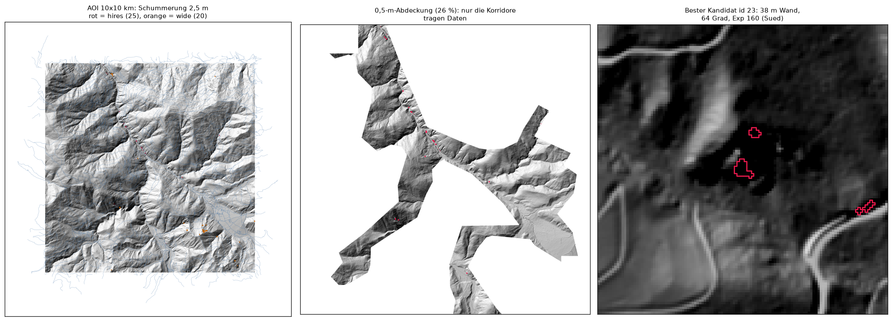

# Felskandidaten aus LiDAR - Welschellen/Rina, Gadertal

Automatisch abgeleitete Kandidatenflaechen fuer Klettern und Bouldern im
5-km-Umkreis um Welschellen/Rina (Gadertal, Suedtirol), aus den
LiDAR-Hoehenmodellen der Autonomen Provinz Bozen.

Erzeugt am 2026-09-09.

**Das Ergebnis ist eine Vorauswahl fuer die Kartenarbeit, kein Kletterfuehrer.**
Jede Flaeche muss vor Ort geprueft werden. Abschnitt 8 ist Teil des
Ergebnisses, nicht Beiwerk.

*Links das gesamte AOI mit beiden Kandidatensaetzen, in der Mitte die
tatsaechliche Abdeckung des 0,5-m-Modells - ein Korridornetz entlang der
Gewaesser, kein Flaechenmodell -, rechts der bestbewertete Kandidat.*

---

## 1. Gebiet

| | |
|---|---|
| Zentrum (WGS84, Vorgabe) | 46.7185 N, 11.8905 E |
| Zentrum laut Nominatim ("Rina - Welschellen") | 46.715605 N, 11.879643 E |
| Abweichung | 890 m |
| Puffer | 5000 m |
| Arbeits-CRS | EPSG:25832 (ETRS89 / UTM 32N) |
| Bounding Box (0,5-m-Grid) | 715897.75, 5172940.75 .. 725897.75, 5182940.75 |

Die Nominatim-Abfrage bestaetigt die Vorgabe grob: der Ortskern liegt rund
890 m suedwestlich des vorgegebenen Zentrums, also weit
innerhalb des 5-km-Puffers. Gerechnet wurde mit der Nutzervorgabe
(`AOI_CENTER_LATLON` in `config.py`). Die Bounding Box wird je Profil auf den
Ursprung des jeweiligen Quellrasters gerastet; die beiden Boxen unterscheiden
sich dadurch um weniger als 2,5 m.

## 2. Datenquellen

WCS der Autonomen Provinz Bozen, `https://geoservices9.civis.bz.it/geoserver/wcs` (WCS 2.0.1).
Die vollstaendige Coverage-Liste aus `GetCapabilities` liegt in
`docs/wcs_coverages.txt` - es wurde keine ID geraten.

| Profil | DGM | DOM |
|---|---|---|
| 0,5 m nativ / 2 m Analyse | `p_bz-Elevation__DigitalTerrainModel-0.5m` | `p_bz-Elevation__DigitalElevationModel-0.5m` |
| 2,5 m nativ / 5 m Analyse | `p_bz-Elevation__DigitalTerrainModel-2.5m` | `p_bz-Elevation__DigitalElevationModel-2.5m` |

DGM und DOM liegen in **beiden** Profilen in derselben Aufloesung vor und
teilen Ursprung, Zellgroesse und NoData (-9999). Ein Resampling des
DOM auf das DGM-Grid war daher **nicht** noetig.

Kontextlayer:

| Layer | Quelle |
|---|---|
| Geologie | WFS `p_bz-Geology:GeologicalUnitsOverview` (geoservices1) |
| Naturparke | WFS `p_bz-TerritorialPlans:LandscapePlan-NationalAndNaturalParks` (geoservices1) |
| Wege/Strassen | OSM via Overpass |

Die detaillierte geologische Karte (`GeologicalUnits-Detailed`, CARG-Blaetter)
wurde getestet und liefert im Gadertal **0 Features** - das Blatt ist dort
nicht kartiert. Ebenso `GeologicalUnits-Aggregated`. Deshalb die
Uebersichtskarte; was das kostet, steht in 8.6.

## 3. Zwei Aufloesungsprofile

Das 0,5-m-Produkt der Provinz ist **kein flaechendeckendes Modell**. Es deckt
im AOI nur 26 % ab, in Korridoren entlang Gewaessern und
Talboeden. Statt still auf ein groeberes Modell auszuweichen, laufen zwei
getrennte Durchgaenge:

| Profil | nativ | Analyseskala | Abdeckung AOI | Rolle |
|---|---|---|---|---|
| `hires` | 0.5 m | 2.0 m | 26.3 % | Primaerergebnis wie spezifiziert |
| `wide` | 2.5 m | 5.0 m | 100.0 % | Ergaenzung fuer die restliche Flaeche |

Die Ergebnisse werden **nicht** vermischt: eigene GeoPackage-Ebene, eigene CSV
und die Spalte `profil` in jeder Zeile.

### Warum das grobe Profil eine andere Schwelle braucht

Dieselbe Gradzahl bedeutet auf beiden Skalen nicht dasselbe. Der Horn-Kernel
misst ueber zwei Zellweiten, bei 5 m also ueber
10 m statt ueber 4 m, und mittelt
dieselbe Wand entsprechend flacher. Mit 60 Grad liefert das
grobe Profil praktisch nichts. Die Schwelle wurde deshalb auf der Flaeche
kalibriert, auf der beide Profile Daten haben (`calibrate.py`, Protokoll in
`docs/kalibrierung_wide.txt`).

**Das Ergebnis der Kalibrierung ist selbst ein Befund:** keine
5-m-Schwelle reproduziert die feine Felsmaske auch nur
annaehernd. Ueber alle geprueften Schwellen von 30 bis 65 Grad bleibt das beste
F1 bei **0,05**; der Recall kommt nie ueber 7 Prozent. Die im feinen Profil
gefundenen Waende sind im Grundriss wenige Meter schmal und auf der
5-m-Skala schlicht nicht mehr aufloesbar.

Daraus folgt: `wide` ist **keine** grobere Fassung derselben Antwort, sondern
ein anderes, deutlich stumpferes Instrument. Es findet nur grosse, ausgedehnte
Waende und uebersieht alles Kleinraeumige. Die Schwelle steht auf
50 Grad - nicht auf dem F1-Optimum (45 Grad,
das nur ueber Recall zustande kommt), sondern dort, wo die zellweise Precision
noch vertretbar ist. Scores sind zwischen den Profilen **nicht** vergleichbar.

## 4. Verarbeitung

1. **Download** gekachelt, jede Kachel auf Platte gecacht, vorhandene Kacheln
   werden uebersprungen (idempotenter Wiederanlauf). Kacheln ohne DGM-Daten
   bekommen einen `.empty`-Marker und werden nicht erneut angefragt; die
   zugehoerige DOM-Kachel wird dann gar nicht erst angefragt.
2. **Mosaik** als VRT ueber die Kacheln; NoData -9999, CRS EPSG:25832.
3. **Zwei Neigungsskalen**: Hangneigung nach Horn einmal nativ, einmal auf der
   groberen Analyseskala. Die native Variante ist verrauscht (Wurzelteller,
   Blockwerk, Filterartefakte), die grobere traegt die Wandstruktur und ist das
   Hauptkriterium. Beide werden im Analysestack gefuehrt
   (`slope05_mean`, `slope05_std`) und verschnitten
   (`REQUIRE_BOTH_SCALES = False`); die native Streuung geht
   ueber die Kompaktheitskomponente in den Score ein.
4. **nDOM** = DOM - DGM, zellweise auf dem gemeinsamen nativen Grid.
5. **Felsmaske**: Neigung(Analyseskala) > 60 Grad **und**
   nDOM < 1.5 m.
6. **Morphologie**: Opening (1x) gegen Salt-and-Pepper, danach
   Closing (2x) gegen Loecher in Wandflaechen, 8er-Nachbarschaft;
   Flaechen unter 10 Zellen entfallen. Danach Labeling
   zusammenhaengender Flaechen.
7. **Kennwerte je Flaeche**: Grundflaeche, vertikale Erstreckung (max-min der
   DGM-Hoehe), mittlere und maximale Neigung, mittlere Exposition (zirkulaeres
   Mittel ueber sin/cos), Zentroid, Hoehe ue.M.
8. **Filter**: vertikale Erstreckung >= 8 m
   **und** Flaeche >= 40 m2.

Die nativen Raster werden ausschliesslich blockweise gelesen (rasterio
windowed, Boundless-Read mit Halo fuer die 3x3-Kernel) und direkt zum
Analysestack verdichtet; sie liegen nie vollstaendig im Speicher. Die
vertikale Erstreckung bleibt dabei **exakt**: je Analysezelle werden Minimum
und Maximum der darunterliegenden nativen Zellen mitgefuehrt, sodass die
Spanne je Flaeche der Vollaufloesung entspricht. Nur Maske und Labeling
arbeiten auf dem fertigen Analyseraster im Speicher - bei
2 m sind das 5000x5000
Zellen, also unkritisch.

## 5. Schwellenwerte

Alle Werte stehen als Konstanten oben in `config.py`.

| Konstante | Wert | Bedeutung |
|---|---|---|
| `SLOPE_MIN_DEG` | 60.0 Grad | Mindestneigung auf der Analyseskala |
| `NDOM_MAX_M` | 1.5 m | maximale Objekthoehe ueber Grund |
| `REQUIRE_BOTH_SCALES` | False | zusaetzlich Steilheit nativ fordern |
| `SLOPE_MIN_DEG_NATIVE` | 55.0 Grad | Schwelle dafuer |
| `OPENING_ITER` / `CLOSING_ITER` | 1 / 2 | Morphologie |
| `MIN_PIXELS` | 10 | Mindestzellen vor Vektorisierung |
| `MIN_VERTICAL_EXTENT_M` | 8.0 m | Filter Wandhoehe |
| `MIN_AREA_M2` | 40.0 m2 | Filter Grundflaeche |

`python3 sensitivity.py --profile hires` zeigt tabellarisch, wie viele
Kandidaten andere Kombinationen von Neigungs- und nDOM-Schwelle liefern, ohne
etwas neu herunterzuladen.

## 6. Score

Gewichtete Summe von fuenf auf [0, 1] normierten Komponenten. Die Gewichte
stehen in `config.py` und werden intern auf Summe 1 normiert, sind also frei
skalierbar.

| Komponente | Spalte | Gewicht | Normierung |
|---|---|---|---|
| Wandhoehe | `score_wall_height` | 0.35 | vert. Erstreckung / 40 m, gekappt bei 1 |
| Neigungskompaktheit | `score_slope_compact` | 0.2 | 1 - Neigungs-Std / 25 Grad |
| Geologie-Eignung | `score_geology` | 0.2 | Tabelle unten |
| Suedexposition | `score_south_aspect` | 0.15 | (1 - cos(Exposition)) / 2; 1 = Sued, 0 = Nord |
| Wegnaehe | `score_access` | 0.1 | 1 bei <= 100 m, linear auf 0 bei 2000 m |

Geologie-Bewertung (erster Treffer gewinnt, case-insensitiv):

| Klasse | Eignung | Schluesselwoerter |
|---|---|---|
| `unbrauchbar_vermutet` | 0.10 | moraen, moran, morän, moren, grundmoraene, werfen … |
| `gemischt_karbonat_werfener` | 0.70 | permo-jurassische sedimentabfolge, sedimentabfolge, permo-giurassica, successione sedimentaria |
| `gut` | 1.00 | dolomit, dolomia, kalk, calcare, riff, schlern … |
| `mittel` | 0.65 | granit, granodiorit, tonalit, pluton, porphyr, vulkanit … |
| `unbekannt` | 0.50 | kein Treffer |

Moraene, Werfener und Bellerophon-Schichten werden als
`unbrauchbar_vermutet` markiert und im Score abgewertet, aber **nicht
entfernt** - sie stehen mit Flag in GeoPackage und CSV.

## 7. Ergebnisse

| Profil | Kacheln | Abdeckung | Maskenzellen | Flaechen | Kandidaten | max. Wand [m] | im Schutzgebiet |
|---|---|---|---|---|---|---|---|
| 0,5 m nativ / 2 m Analyse | 53/90 | 26.3 % | 1,893 | 25 | 25 | 41.3 | 0 |
| 2,5 m nativ / 5 m Analyse | 25/25 | 100.0 % | 1,339 | 20 | 20 | 101.0 | 1 |

Dateien in `output/`:

- `felskandidaten.gpkg` - je Profil eine Kandidatenebene
  (`felskandidaten_05m`, `felskandidaten_25m`), dazu die Kontextlayer
  `geologie`, `schutzgebiete`, `wege`
- `felskandidaten.csv` - beide Profile zusammen, Spalte `profil`, nach Score sortiert
- `felskandidaten_05m.csv`, `felskandidaten_25m.csv` - je Profil einzeln
- `felskandidaten.qgs` - QGIS-Projekt mit Schummerung, nDOM, Hangneigung,
  Kandidaten und Kontextlayern (relative Pfade)

Zwischenprodukte je Profil in `data/derived/<tag>/`: Analysestack, Neigung,
Exposition, nDOM, Schummerung.

---

## 8. Einschraenkungen

**Wer die Kandidaten ohne diesen Abschnitt liest, liest sie falsch.**

### 8.1 2,5D - Ueberhaenge sind physikalisch nicht abbildbar

DGM und DOM sind 2,5D-Raster: ein Hoehenwert pro Zelle. Eine Wand mit Dach,
ein Ueberhang, eine Hoehle, ein Blockdach koennen darin grundsaetzlich nicht
dargestellt werden. Solche Formen erscheinen **bestenfalls als senkrecht**
(90 Grad) und werden dadurch systematisch unterschaetzt - ausgerechnet die
Formen, die fuer Sportklettern und Bouldern am interessantesten sind, sind im
Modell nicht von einer schlichten senkrechten Wand zu unterscheiden.
Umgekehrt gilt: eine als nahezu senkrecht gefundene Flaeche kann vor Ort
deutlich ueberhaengend sein - oder eben glatt und senkrecht. Das Verfahren
kann Ueberhaenge weder finden noch ausschliessen. Aus demselben Grund ist die
gemessene Maximalneigung nach oben gedeckelt und die Neigungsverteilung in
steilem Gelaende gestaucht.

### 8.2 Bodenfilterung entfernt regelmaessig echten Fels

Das DGM entsteht aus der Bodenpunktklassifikation der LiDAR-Punktwolke. Diese
Filterung entfernt regelmaessig auch echten Fels: freistehende Bloecke,
Zinnen, Tuerme und schmale Rippen werden als "nicht Boden" verworfen oder in
die Umgebung eingeglaettet, kleine Baender und Absaetze verschwinden ganz. In
steilem Gelaende neigen Bodenfilter zusaetzlich dazu, Wandfuesse zu ueber- und
Wandkoepfe zu unterschaetzen, sodass die vertikale Erstreckung eher zu klein
als zu gross ausfaellt. Genau die Objekte, die fuers Bouldern zaehlen -
einzelne Bloecke von wenigen Metern - liegen an der Grenze dessen, was die
Filterung ueberhaupt stehen laesst. Umgekehrt erzeugen Filterartefakte
(Wurzelteller, Gelaendekanten, Restvegetation, Stuetzmauern, Wegboeschungen,
Lawinenverbauungen) senkrechte Stufen, die als Fels erscheinen, ohne welcher
zu sein. Ein Teil der Kandidaten ist deshalb Infrastruktur, kein Fels.

### 8.3 Abdeckungsluecke im 0,5-m-Modell

Das 0,5-m-Produkt deckt im AOI nur **26 %** ab, in
korridorfoermigen Streifen entlang der Gewaesser und Talboeden. Rund
74 % des Umkreises - darunter ein grosser Teil der
Hangflanken, auf denen Felswaende ueberhaupt erst zu erwarten sind - sind in
0,5 m **gar nicht erfasst**. Das `hires`-Ergebnis ist daher *keine*
vollstaendige Inventur des 5-km-Umkreises, sondern eine vollstaendige
Auswertung der 26 % Flaeche mit Daten. Das
`wide`-Ergebnis schliesst diese Luecke flaechenmaessig, aber nur auf
2.5 m Grundaufloesung.

### 8.4 nDOM-Schwelle schneidet in beide Richtungen

`nDOM < 1.5 m` entfernt bewachsene Steilhaenge, entfernt aber auch
**Fels unter Baumkronen** - im Gadertal betrifft das viele niedrigere
Wandstufen im Wald, die kletterbar waeren. Umgekehrt bleiben bewachsene
Felspartien faelschlich stehen, wenn die Bodenfilterung Vegetation bereits ins
DGM uebernommen hat. Die Schwelle ist ein Vegetationsfilter, kein Felsnachweis.

### 8.5 Skalenwahl und Bouldern

Die Maske arbeitet im Profil `hires` auf 2 m,
im Profil `wide` auf 5 m. Bloecke unter
etwa 4 m Kantenlaenge werden im besten Fall weggemittelt.
Der Filter `MIN_VERTICAL_EXTENT_M = 8` entfernt
Boulderbloecke ohnehin vollstaendig. **Fuer Bouldern taugt diese
Parametrisierung nicht**; wer Bloecke sucht, muss `MIN_VERTICAL_EXTENT_M` und
`MIN_AREA_M2` deutlich senken, `COARSE_RES` auf 1 m stellen, ausschliesslich
das Profil `hires` verwenden - und mit erheblich mehr Fehlalarmen rechnen.

### 8.6 Geologie ist zu grob fuer die gewuenschte Unterscheidung

Die Formation wird **nur am Zentroid** gejoint; grosse Flaechen ueber einer
Formationsgrenze bekommen dadurch eine einzige, moeglicherweise falsche
Zuordnung.

Schwerer wiegt: die verfuegbare Uebersichtskarte gibt **genau die
Unterscheidung nicht her, um die es geht**. Im AOI kommen nur fuenf Einheiten
vor; Dolomit, Kalk, Werfener- und Bellerophon-Schichten stecken gemeinsam in
der einen Einheit "Permo-jurassische Sedimentabfolge". Eine Aufwertung von
Dolomit/Kalk gegenueber Werfener/Bellerophon ist aus dieser Datenlage **nicht
ableitbar**. Die Einheit laeuft deshalb als eigene Klasse
`gemischt_karbonat_werfener` und wird mit 0,70 leicht positiv bewertet - mit
der geologischen Begruendung, dass in dieser Abfolge die wandbildenden
Gesteine die Karbonate sind, waehrend Werfener-Schichten Wiesen- und
Schutthaenge bilden; die Neigungsschwelle von 60 Grad
selektiert also bereits weitgehend das kompetente Gestein. Das ist eine
plausible Annahme, **kein kartierter Befund**. Die Schluesselwortregeln fuer
Dolomit/Kalk und fuer Moraene/Werfener/Bellerophon bleiben in `config.py`
erhalten und greifen, sobald eine feiner aufgeloeste Karte vorliegt.

Auch sonst sagt "Dolomit/Kalk = gut" nichts ueber Felsqualitaet im Detail -
Bruechigkeit, Schichtung, Verwitterung, Bewuchs.

### 8.7 Wegdistanz ist kein Zustieg

`dist_weg_m` ist die **Luftlinie** vom Zentroid zum naechsten OSM-Weg.
Hoehenunterschied, Steilheit, Gewaesser, Zaeune, Privatgrund und die Frage, ob
der Weg ueberhaupt zur Wand fuehrt, sind nicht beruecksichtigt. 100 m Luftlinie
koennen 200 Hoehenmeter weglos im Steilwald bedeuten. Die OSM-Wegdichte ist
ausserdem nicht homogen.

### 8.8 Kein Bodenabgleich

Es wurde **keine** Kandidatenflaeche im Gelaende oder gegen Orthofotos
geprueft. Es gibt keine Trainingsdaten, keine Validierung, keine
Treffergenauigkeit. Die Zahlen in Abschnitt 7 sagen, wie viele Flaechen die
Regeln liefern - nicht, wie viele davon Fels sind. Eine Stichprobe der drei
bestbewerteten hires-Kandidaten gegen die Rohkacheln zeigt immerhin
konsistente Werte (Neigung p95 69-73 Grad, 59-96 m Hoehenspanne auf
60 x 60 m); das ist eine Plausibilitaets-, keine Felspruefung.

### 8.9 Rechtliches und Sicherheit

Das Flag `im_schutzgebiet` markiert Lage in einem Natur- oder Nationalpark
(im Umkreis liegen die Naturparke Puez-Geisler und Fanes-Sennes-Prags). In
Schutzgebieten ist Klettern regelmaessig eingeschraenkt oder verboten; das
Flag ersetzt keine Pruefung der Schutzgebietsverordnung. Unabhaengig davon
sagt keine dieser Flaechen etwas ueber Grundeigentum, Betretungsrechte,
Vogelschutz-Sperrzeiten, Steinschlag, Absturzgelaende oder Felsqualitaet.
Erschliessung oder Begehung nur nach Klaerung mit Grundeigentuemern,
Behoerden und dem zustaendigen Alpenverein.
